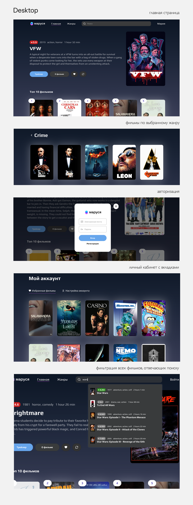
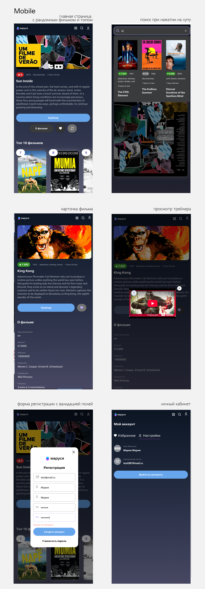

## Онлайн-платформа Vk Marusia 🍿

### Описание

Приложение, позволяющее пользователям в будущем находить и оценивать фильмы. Бета-версия позволяет просматривать случайные фильмы и видеть список топовых фильмов по IMDb-рейтингу, искать фильмы по запросам пользователей и добавлять их в избранное. Пользователь может просмотреть список существующих киножанров, выбрать один из них и перейти на страницу с фильмами, которые к нему относятся. При нажатии на карточку фильма пользователь попадает на его страницу с описанием картины, кнопкой просмотра трейлера и кнопкой для добавления/удаления в избранное.
Функция добавления фильма в избранное доступна только для авторизованных пользователей. Вызов формы авторизации происходит при нажатии на кнопку «Войти» в шапке сайта или попытке добавить фильм в избранное (если авторизация не пройдена);

Приложение разработано под десктопную и мобильную версию с поддержкой планшетных устройств

### Запуска проекта :

Установите все необходимые зависимости и переходите к просмотру на локалхосте:
```js
npm install
npm run build 
npm run preview
```


Десктопная версия


Мобильная версия 


